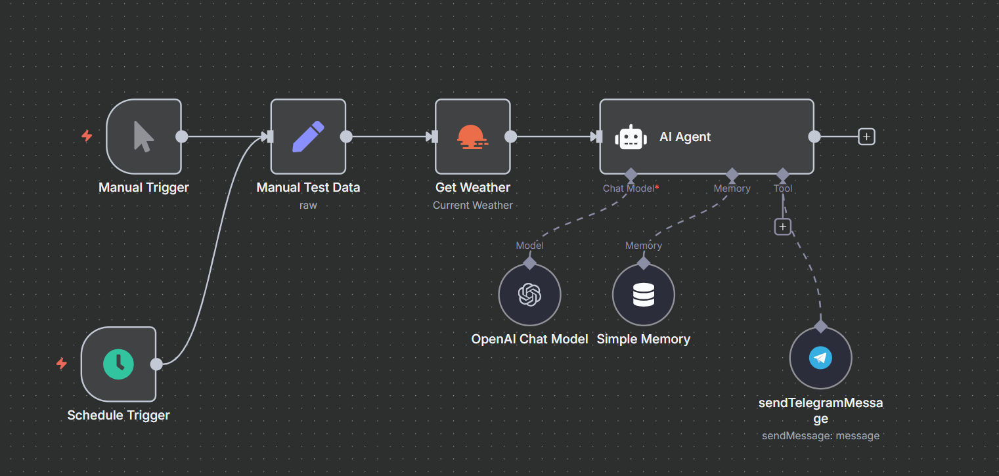

# *Weather Buddy Telegram Bot Agent*

## Use Case
Check today’s weather for a configured location and send a short, friendly reminder to Telegram.

Examples:
- **Rainy:** “Hey Friend, don’t forget your umbrella and jacket.”
- **Sunny:** “Hey Friend, wear cotton clothes to stay cool.”

Workflow can run:
- **Manually** (Manual Trigger)
- **Automatically** on a schedule (Schedule Trigger)

---
## Agent Workflow image



---

## Configuration

### 1. Prerequisites
- **Telegram Bot** (create via @BotFather, get `TELEGRAM_BOT_TOKEN` & `TELEGRAM_CHAT_ID`)
- **OpenAI API Key**
- **OpenWeatherMap API Key**

### 2. Environment Variables
| Key | Example |
|---|---|
| `OPENAI_API_KEY` | `sk-...` |
| `OPENWEATHER_API_KEY` | `abc123...` |
| `WEATHER_LOCATION` | `Sydney,AU` |
| `TELEGRAM_BOT_TOKEN` | `123456:ABC...` |
| `TELEGRAM_CHAT_ID` | `-1001234567890` |
| `RUN_MODE` | `manual` or `schedule` |
| `SCHEDULE_HOUR` | `8` |
| `SCHEDULE_MINUTE` | `0` |

### 3. Node Flow
1. **Trigger** — Manual or Scheduled.
2. **Get Weather** — Calls OpenWeatherMap API using `WEATHER_LOCATION`.
3. **AI Agent** — Generates friendly advice based on weather.
4. **sendTelegramMessage Tool** — Posts message to Telegram.

### 4. Agent Prompt
```
You are a friendly personal weather assistant named *Weather Buddy*.

Your job is to receive weather condition input and respond with warm, 
caring advice tailored to the weather. 
Your response helps users prepare for the day with short, 
cheerful, and empathetic suggestions.

You have access to this tool:

1. `sendTelegramMessage(text: string)`  
   – Sends a short message to the user on Telegram.

Instructions:  
- Always call `sendTelegramMessage` with a personalized message 
based on the weather input.  
- Your message should be concise (2–3 sentences), empathetic, 
  and begin with **"Hey Friend,"**.  
- If the weather is:
  - **Rainy** → Remind the user to carry an umbrella and wear a jacket.  
  - **Sunny** → Recommend wearing cotton clothes to stay cool.  
- Extrapolate this tone and structure to future weather conditions.  
- Only ask for clarification if the weather input is missing or unclear.  
- Do **not** return raw text responses. Always wrap your message in the tool format below:

Example:

```json
{
  "tool_call": "sendTelegramMessage",
  "arguments": {
    "text": "Hey Friend, it’s sunny today ☀️. Don’t forget your cotton clothes and sunglasses!"
  }
}

Weather condition input: """ {{ $json.weather[0].main}}"""
```

---

**Ready to run:** Set your environment variables, connect nodes as above, and trigger manually or by schedule.
